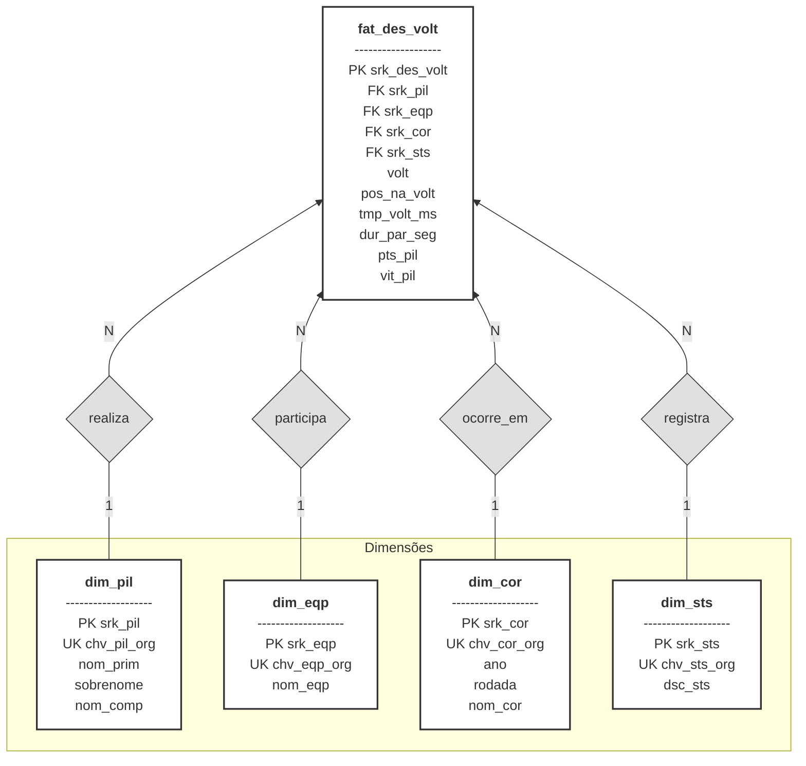

# Diagrama Entidade-Relacionamento (DER) — Camada Gold

## 1. Introdução

Este documento descreve o Diagrama Entidade-Relacionamento (DER) da Camada Gold do data lakehouse de Fórmula 1. O objetivo é apresentar uma visão lógica e visual do Star Schema que sustenta o modelo analítico, permitindo rápidas iterações de BI e governança consistente com o MER documentado em `mer_gold.md`.

A Camada Gold agrega métricas e dimensões já tratadas, otimizadas para consumo em dashboards que comparam pilotos, equipes, pit stops e incidentes. O DER garante que todos entendam a estrutura dimensional, as cardinalidades e os atributos fundamentais que suportam as consultas analíticas.

## 2. Visão Geral do DER

**Fonte:** Autoria de [Fernando Carrijo](https://github.com/show-dawn), [Júlio Cesar](https://github.com/Julio1099), [Kaleb Macedo](https://github.com/kalebmacedo) e [Othavio Bolzan](https://github.com/bolzanMGB)

## 3. Componentes do Diagrama

- **fat_des_volt**: É a tabela de fato central. Cada linha representa a menor granularidade disponível (volta do piloto na corrida) e carrega métricas de tempo, pit stop, pontos e vitórias.

- **Dimensões** (`dim_pil`, `dim_eqp`, `dim_cor`, `dim_sts`): Oferecem contexto descritivo. Todas utilizam surrogate keys (`srk_...`) e mantêm a business key (`chv_..._org`) para rastreabilidade.

- **Cardinalidades**: As relações são `1:N`, partindo das dimensões (1) para a fato (N). Assim, um piloto pode existir sem registros na fato (0..N), mas cada ocorrência da fato referencia obrigatoriamente uma dimensão.

- **Integridade**: A fato possui a restrição única `(srk_pil, srk_cor, volt)`, garantindo unicidade do evento analítico.

## 4. Histórico de Versões

| Data | Versão | Descrição | Autor | Revisor |
| :--: | :----: | :-------- | :---- | :----- |
| 31/10/2025 | `1.0` | Documentação do DER. | [Kaleb Macedo](https://github.com/kalebmacedo), [Othavio Bolzan](https://github.com/bolzanMGB) |  |
| 16/11/2025 | 1.1 | Sincronização do DER com o DDL da Camada Gold. | [Júlio Cesar](https://github.com/Julio1099) |  [Othavio Bolzan](https://github.com/bolzanMGB) |

