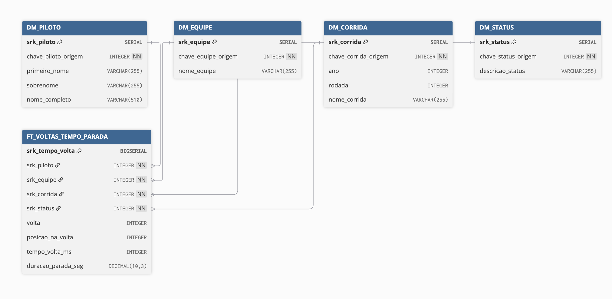

# Diagrama Lógico de Dados (DLD) - Camada Gold

## 1. Introdução

Este documento detalha cada tabela, coluna e a lógica de transformação (ETL) utilizada para popular a Camada Gold (Data Warehouse), que segue o padrão Dimensional (Star Schema).

## 2. Tabela de Fato

A tabela fato `fat_des_volt` é responsável por capturar as métricas de desempenho por volta e de paradas nos boxes. É a granularidade mais fina do modelo.

### Tabela 1 - Tabela Fato fat_des_volt

| Coluna | Tipo SQL | Chave | Descrição | Origem (Silver) | Lógica de População (ETL Silver -> Gold) |
|--------|----------|-------|-----------|-----------------|------------------------------------------|
| srk_tmp_volt | BIGSERIAL | PK | Chave sub-rogada (PK) da tabela de fato. | (Gerada) | Gerada automaticamente pelo PostgreSQL. |
| srk_pil | INTEGER | FK | Chave sub-rogada para a dimensão Piloto. | id_piloto | JOIN com dim_pil (usando id_piloto da Silver = chv_pil_org da Gold). |
| srk_eqp | INTEGER | FK | Chave sub-rogada para a dimensão Equipe. | id_equipe | JOIN com dim_eqp (usando id_equipe como Business Key). |
| srk_cor | INTEGER | FK | Chave sub-rogada para a dimensão Corrida. | id_corrida | JOIN com dim_cor (usando id_corrida como Business Key). |
| srk_sts | INTEGER | FK | Chave sub-rogada para a dimensão Status. | id_status | JOIN com dim_sts (usando id_status como Business Key). |
| volt | INTEGER |  | Número da volta do circuito. | volta | Direto da Silver, com CAST para IntegerType. Registros onde volt é NULL são FILTRADOS no ETL. |
| pos_volt | INTEGER |  | Posição do piloto na volta. | posicao_na_volta | CAST para IntegerType. |
| tmp_volt_ms | INTEGER |  | Tempo total da volta em milissegundos. | tempo_volta_ms | Direto da Silver, com CAST para IntegerType. Registros onde tmp_volt_ms é NULL são FILTRADOS no ETL. |
| dur_par_seg | DECIMAL(10, 3) |  | Duração da parada nos boxes em segundos. | duracao_parada_seg | CAST para DecimalType(10, 3). |
| pnt_pil | DECIMAL(10, 1) |  | Pontos obtidos pelo piloto na corrida. | pontos | Agregado da Silver (tabela results). DEFAULT 0. |
| vit_pil | INTEGER |  | Indicador de vitória (1 ou 0). | posicao_final | Lógica condicional (e.g., CASE WHEN posicao_final = 1 THEN 1 ELSE 0 END). DEFAULT 0. |

**Fonte:** Autoria de [Fernando Carrijo](https://github.com/show-dawn), [Júlio Cezar](https://github.com/Julio1099), [Kaleb Macedo](https://github.com/kalebmacedo) e [Othavio Bolzan](https://github.com/bolzanMGB)

## 3. Dimensões

### 3.1. Dimensão: dim_pil

Armazena atributos estáticos sobre os pilotos.

#### Tabela 2 - Tabela dimensão dim_pil

| Coluna | Tipo SQL | Chave | Descrição | Origem (Silver) | Lógica de População (ETL Silver -> Gold) |
|--------|----------|-------|-----------|-----------------|------------------------------------------|
| srk_pil | SERIAL | PK | Chave sub-rogada da Dimensão. | (Gerada) | Gerada automaticamente pelo PostgreSQL. |
| chv_pil_org | INTEGER | BK | Chave de Negócio. ID do piloto na origem. | id_piloto | Renomeado de id_piloto para chv_pil_org e selecionado como DISTINCT. |
| prim_nom | VARCHAR(255) |  | Primeiro nome do piloto. | primeiro_nome_piloto | Alias. Unicidade garantida por chv_pil_org. |
| sob_nom | VARCHAR(255) |  | Sobrenome do piloto. | sobrenome_piloto | Alias. Unicidade garantida por chv_pil_org. |
| nom_com | VARCHAR(510) |  | Nome e sobrenome combinados. | - | Coluna GERADA (Calculated Column) no DDL do PostgreSQL: `(prim_nom \|\| ' ' \|\| sob_nom)` |

**Fonte:** Autoria de [Fernando Carrijo](https://github.com/show-dawn), [Júlio Cezar](https://github.com/Julio1099), [Kaleb Macedo](https://github.com/kalebmacedo) e [Othavio Bolzan](https://github.com/bolzanMGB)

### 3.2. Dimensão: dim_eqp

Armazena atributos estáticos sobre as equipes/construtoras.

#### Tabela 3 - Tabela dimensão dim_eqp

| Coluna | Tipo SQL | Chave | Descrição | Origem (Silver) | Lógica de População (ETL Silver -> Gold) |
|--------|----------|-------|-----------|-----------------|------------------------------------------|
| srk_eqp | SERIAL | PK | Chave sub-rogada da Dimensão. | (Gerada) | Gerada automaticamente pelo PostgreSQL. |
| chv_eqp_org | INTEGER | BK | Chave de Negócio. ID da equipe na origem. | id_equipe | Renomeado de id_equipe para chv_eqp_org e selecionado como DISTINCT. |
| nom_eqp | VARCHAR(255) |  | Nome oficial da equipe. | nome_equipe | Direto da Silver. Unicidade garantida por chv_eqp_org. |

**Fonte:** Autoria de [Fernando Carrijo](https://github.com/show-dawn), [Júlio Cezar](https://github.com/Julio1099), [Kaleb Macedo](https://github.com/kalebmacedo) e [Othavio Bolzan](https://github.com/bolzanMGB)

### 3.3. Dimensão: dim_cor

Armazena atributos estáticos sobre as corridas.

#### Tabela 4 - Tabela dimensão dim_cor

| Coluna | Tipo SQL | Chave | Descrição | Origem (Silver) | Lógica de População (ETL Silver -> Gold) |
|--------|----------|-------|-----------|-----------------|------------------------------------------|
| srk_cor | SERIAL | PK | Chave sub-rogada da Dimensão. | (Gerada) | Gerada automaticamente pelo PostgreSQL. |
| chv_cor_org | INTEGER | BK | Chave de Negócio. ID da corrida na origem. | id_corrida | Renomeado de id_corrida para chv_cor_org e selecionado como DISTINCT. |
| ano | INTEGER |  | Ano da temporada. | ano | Direto da Silver. |
| rod | INTEGER |  | Número da rodada no calendário. | rodada | Alias de rodada. |
| nom_cor | VARCHAR(255) |  | Nome do Grande Prêmio. | nome_corrida | Alias de nome_corrida. |

**Fonte:** Autoria de [Fernando Carrijo](https://github.com/show-dawn), [Júlio Cezar](https://github.com/Julio1099), [Kaleb Macedo](https://github.com/kalebmacedo) e [Othavio Bolzan](https://github.com/bolzanMGB)

### 3.4. Dimensão: dim_sts

Armazena atributos sobre o status final do piloto.

#### Tabela 5 - Tabela dimensão dim_sts

| Coluna | Tipo SQL | Chave | Descrição | Origem (Silver) | Lógica de População (ETL Silver -> Gold) |
|--------|----------|-------|-----------|-----------------|------------------------------------------|
| srk_sts | SERIAL | PK | Chave sub-rogada da Dimensão. | (Gerada) | Gerada automaticamente pelo PostgreSQL. |
| chv_sts_org | INTEGER | BK | Chave de Negócio. ID do status na origem. | id_status | Renomeado de id_status para chv_sts_org e selecionado como DISTINCT. |
| des_sts | VARCHAR(255) |  | Descrição textual do status (e.g., Finished, Accident). | descricao_status | Alias de descricao_status. |

**Fonte:** Autoria de [Fernando Carrijo](https://github.com/show-dawn), [Júlio Cezar](https://github.com/Julio1099), [Kaleb Macedo](https://github.com/kalebmacedo) e [Othavio Bolzan](https://github.com/bolzanMGB)

## 4. Gráfico do DLD

**Fonte:** Autoria de [Fernando Carrijo](https://github.com/show-dawn), [Júlio Cesar](https://github.com/Julio1099), [Kaleb Macedo](https://github.com/kalebmacedo) e [Othavio Bolzan](https://github.com/bolzanMGB)

## Histórico de versão

| Data | Versão | Descrição | Autor | Revisor |
|:---:|:---:|:---:|:---:|:---:|
| 29/10/2025 | **`1.0`**      | Ajuste para representação de tabela única | [Júlio Cesar](https://github.com/Julio1099) | [Kaleb Macedo](https://github.com/kalebmacedo) |
| 31/10/2025 | **`1.1`** | Refatorização da documentação | [Othavio Bolzan](https://github.com/bolzanMGB) | [Kaleb Macedo](https://github.com/kalebmacedo) |
| 14/11/2025 | **`1.2`** | Adição do Gráfico do DLD | [Kaleb Macedo](https://github.com/kalebmacedo) |  |
| 16/11/2025 | `1.3` | Sincronização do MER com o DDL da Camada Gold. | [Júlio Cesar](https://github.com/Julio1099) |  [Othavio Bolzan](https://github.com/bolzanMGB) |