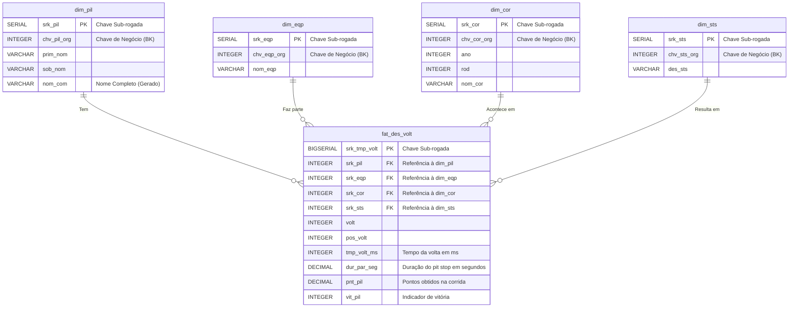

# Modelo Entidade-Relacionamento (MER) - Camada GOLD

## 1. Introdução

O modelo da Camada Gold (Data Warehouse) segue o padrão **Star Schema (Esquema Estrela)**, uma estrutura voltada para análises OLAP (Online Analytical Processing). Nesse formato, os dados são organizados em uma tabela fato central — `fat_des_volt` — que se conecta a quatro tabelas de dimensão por meio de chaves sub-rogadas (SRK). Essa modelagem tem como propósito oferecer uma visão clara, integrada e analítica do desempenho dos pilotos, permitindo explorar métricas relacionadas às voltas e paradas nos boxes de forma eficiente.

## 2. Diagrama Lógico – Star Schema

O modelo lógico da Camada Gold (Data Warehouse) adota o padrão **Star Schema (Esquema Estrela)**, no qual os dados são organizados em uma tabela fato central, conectada a tabelas de dimensão por meio de relacionamentos 1:N (um para muitos).

A tabela fato `fat_des_volt` armazena os eventos e métricas de desempenho por volta e paradas nos boxes, enquanto as dimensões (`dim_pil`, `dim_eqp`, `dim_cor` e `dim_sts`) fornecem o contexto descritivo dessas medições.

A seguir, apresenta-se uma visão simplificada do esquema estrela, que ilustra de forma geral a relação central entre a Tabela Fato e suas Dimensões.

```
                      dim_pil
                        |
                        |
                        |
      dim_sts ---- fat_des_volt ---- dim_eqp
                        |
                        |
                        |
                      dim_cor
```

Na sequência, é exibida a versão completa do diagrama entidade-relacionamento (ER), que detalha as conexões lógicas entre as tabelas, evidenciando as cardinalidades e o papel de cada dimensão dentro da estrutura do Data Warehouse.



## 3. Descrição das Entidades

### 3.1. Fato: fat_des_volt

A Tabela de Fato captura as métricas de desempenho de um piloto em uma volta ou o tempo de parada nos boxes.

| Atributo | Chave | Tipo SQL | Descrição |
|----------|-------|----------|-----------|
| srk_tmp_volt | PK | BIGSERIAL | Chave primária. Identificador único do registro de fato. |
| srk_pil | FK | INTEGER | Chave estrangeira para o Piloto. |
| srk_eqp | FK | INTEGER | Chave estrangeira para a Equipe/Construtora. |
| srk_cor | FK | INTEGER | Chave estrangeira para a Corrida. |
| srk_sts | FK | INTEGER | Chave estrangeira para o Status de Resultado. |
| volt |  | INTEGER | Número da volta registrada. |
| pos_volt |  | INTEGER | Posição do piloto ao cruzar a linha de chegada da volta. |
| tmp_volt_ms |  | INTEGER | Tempo total da volta em milissegundos. |
| dur_par_seg |  | DECIMAL(10, 3) | Duração da parada nos boxes em segundos (0 se não houve parada naquela volta). |
| pnt_pil |  | DECIMAL(10, 1) | Pontos obtidos pelo piloto na corrida (repetidos em todas as voltas daquela prova). |
| vit_pil |  | INTEGER | Indicador 1/0 se o piloto venceu a corrida (repetido nas voltas da prova). |

### 3.2. Dimensão: dim_pil

Armazena atributos estáticos sobre os pilotos.

| Atributo | Chave | Tipo SQL | Descrição |
|----------|-------|----------|-----------|
| srk_pil | PK | SERIAL | Chave primária. |
| chv_pil_org | BK | INTEGER | Chave de Negócio (Business Key). ID original do piloto na Camada Silver/Raw. |
| prim_nom |  | VARCHAR(255) | Primeiro nome. |
| sob_nom |  | VARCHAR(255) | Sobrenome. |
| nom_com |  | VARCHAR(510) | Nome e sobrenome concatenados (coluna gerada). |

### 3.3. Dimensão: dim_eqp

Armazena atributos estáticos sobre as equipes/construtoras.

| Atributo | Chave | Tipo SQL | Descrição |
|----------|-------|----------|-----------|
| srk_eqp | PK | SERIAL | Chave primária. |
| chv_eqp_org | BK | INTEGER | Chave de Negócio. ID original da equipe. |
| nom_eqp |  | VARCHAR(255) | Nome oficial da equipe. |

### 3.4. Dimensão: dim_cor

Armazena atributos estáticos sobre as corridas.

| Atributo | Chave | Tipo SQL | Descrição |
|----------|-------|----------|-----------|
| srk_cor | PK | SERIAL | Chave primária. |
| chv_cor_org | BK | INTEGER | Chave de Negócio. ID original da corrida. |
| ano |  | INTEGER | Ano da temporada. |
| rod |  | INTEGER | Número da rodada no calendário. |
| nom_cor |  | VARCHAR(255) | Nome do Grande Prêmio. |

### 3.5. Dimensão: dim_sts

Armazena atributos sobre o status final do piloto.

| Atributo | Chave | Tipo SQL | Descrição |
|----------|-------|----------|-----------|
| srk_sts | PK | SERIAL | Chave primária. |
| chv_sts_org | BK | INTEGER | Chave de Negócio. ID original do status. |
| des_sts |  | VARCHAR(255) | Descrição textual do status (e.g., Finished, Accident, Engine). |

## Histórico de Versão

| Data | Versão | Descrição | Autor | Revisor |
| :---: | :---: | :--- | :--- | :--- |
| 29/10/2025 | `1.0` | Criação inicial do MER para Fórmula 1. | [Júlio Cesar](https://github.com/Julio1099) | [Kaleb Macedo](https://github.com/kalebmacedo) |
| 30/10/2025 | `1.1` | Criação do diagrama para o MER | [Kaleb Macedo](https://github.com/kalebmacedo)| [Othavio Bolzan](https://github.com/bolzanMGB) |
| 31/10/2025 | **`1.2`** | Refatorização da documentação | [Othavio Bolzan](https://github.com/bolzanMGB) | [Kaleb Macedo](https://github.com/kalebmacedo) |
| 16/11/2025 | `1.3` | Sincronização do MER com o DDL da Camada Gold. | [Júlio Cesar](https://github.com/Julio1099) |  [Othavio Bolzan](https://github.com/bolzanMGB)