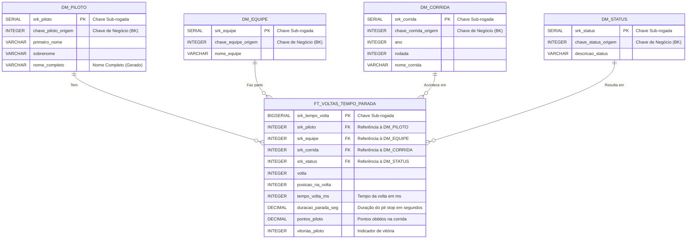

# Modelo Entidade-Relacionamento (MER) - Camada GOLD

## 1. Introdução

O modelo da Camada Gold (Data Warehouse) segue o padrão Star Schema (Esquema Estrela), uma estrutura voltada para análises OLAP (Online Analytical Processing). Nesse formato, os dados são organizados em uma tabela fato central — `FT_VOLTAS_TEMPO_PARADA` — que se conecta a quatro tabelas de dimensão por meio de chaves sub-rogadas (`SRK`). Essa modelagem tem como propósito oferecer uma visão clara, integrada e analítica do desempenho dos pilotos, permitindo explorar métricas relacionadas às voltas e paradas nos boxes de forma eficiente.


## 2. Diagrama Lógico – Star Schema

O modelo lógico da Camada Gold (Data Warehouse) adota o padrão Star Schema (Esquema Estrela), no qual os dados são organizados em uma tabela fato central, conectada a tabelas de dimensão por meio de relacionamentos 1:N (um para muitos).

A tabela fato `FT_VOLTAS_TEMPO_PARADA` armazena os eventos e métricas de desempenho por volta e paradas nos boxes, enquanto as dimensões (`DM_PILOTO`, `DM_EQUIPE`, `DM_CORRIDA` e `DM_STATUS`) fornecem o contexto descritivo dessas medições.

A seguir, apresenta-se uma visão simplificada do esquema estrela, que ilustra de forma geral a relação central entre a Tabela Fato e suas Dimensões.

<p align="center">Tabela 1 – Visão Simplificada do Esquema Estrela</p>

```
                        DM_PILOTO
                            |
                            |
                            |
        DM_STATUS ---- FT_VOLTAS_TEMPO_PARADA ---- DM_EQUIPE
                            |
                            |
                            |
                        DM_CORRIDA
```

<p align="center"><b>Fonte: </b>Autoria de <a href="https://github.com/show-dawn"> Fernando Carrijo</a>. <a href="https://github.com/Julio1099"> Júlio Cezar </a>, <a href="https://github.com/kalebmacedo"> Kaleb Macedo</a> e <a href="https://github.com/bolzanMGB"> Othavio Bolzan</a></p>

Na sequência, é exibida a versão completa do diagrama entidade-relacionamento (ER), que detalha as conexões lógicas entre as tabelas, evidenciando as cardinalidades e o papel de cada dimensão dentro da estrutura do Data Warehouse.

<p align="center">Tabela 2 – Modelo Entidade-Relacionamento (Camada Gold)</p>



<p align="center"><b>Fonte: </b>Autoria de <a href="https://github.com/show-dawn"> Fernando Carrijo</a>. <a href="https://github.com/Julio1099"> Júlio Cezar </a>, <a href="https://github.com/kalebmacedo"> Kaleb Macedo</a> e <a href="https://github.com/bolzanMGB"> Othavio Bolzan</a></p>


## 3. Descrição das Entidades

### 3.1. Fato: FT_VOLTAS_TEMPO_PARADA

A Tabela de Fato captura as métricas de desempenho de um piloto em uma volta ou o tempo de parada nos boxes.

<p align="center">Tabela 3 – Tabela FT_VOLTAS_TEMPO_PARADA</p>

| Atributo | Chave | Tipo SQL | Descrição |
|-----------|--------|----------|------------|
| srk_tempo_volta | PK | BIGSERIAL | Chave primária. Identificador único do registro de fato. |
| srk_piloto | FK | INTEGER | Chave estrangeira para o Piloto. |
| srk_equipe | FK | INTEGER | Chave estrangeira para a Equipe/Construtora. |
| srk_corrida | FK | INTEGER | Chave estrangeira para a Corrida. |
| srk_status | FK | INTEGER | Chave estrangeira para o Status de Resultado. |
| volta |  | INTEGER | Número da volta registrada. |
| posicao_na_volta |  | INTEGER | Posição do piloto ao cruzar a linha de chegada da volta. |
| tempo_volta_ms |  | INTEGER | Tempo total da volta em milissegundos. |
| duracao_parada_seg |  | DECIMAL(10, 3) | Duração da parada nos boxes em segundos (0 se não houve parada naquela volta). |
| pontos_piloto |  | DECIMAL(10, 1) | Pontos obtidos pelo piloto na corrida (repetidos em todas as voltas daquela prova). |
| vitorias_piloto |  | INTEGER | Indicador 1/0 se o piloto venceu a corrida (repetido nas voltas da prova). |

<p align="center"><b>Fonte: </b>Autoria de <a href="https://github.com/show-dawn"> Fernando Carrijo</a>. <a href="https://github.com/Julio1099"> Júlio Cezar </a>, <a href="https://github.com/kalebmacedo"> Kaleb Macedo</a> e <a href="https://github.com/bolzanMGB"> Othavio Bolzan</a></p>

---

### 3.2. Dimensão: DM_PILOTO

Armazena atributos estáticos sobre os pilotos.

<p align="center">Tabela 4 – Tabela DM_PILOTO</p>

| Atributo | Chave | Tipo SQL | Descrição |
|-----------|--------|----------|------------|
| srk_piloto | PK | SERIAL | Chave primária. |
| chave_piloto_origem | BK | INTEGER | Chave de Negócio (Business Key). ID original do piloto na Camada Silver/Raw. |
| primeiro_nome |  | VARCHAR(255) | Primeiro nome. |
| sobrenome |  | VARCHAR(255) | Sobrenome. |
| nome_completo |  | VARCHAR(510) | Nome e sobrenome concatenados (coluna gerada). |

<p align="center"><b>Fonte: </b>Autoria de <a href="https://github.com/show-dawn"> Fernando Carrijo</a>. <a href="https://github.com/Julio1099"> Júlio Cezar </a>, <a href="https://github.com/kalebmacedo"> Kaleb Macedo</a> e <a href="https://github.com/bolzanMGB"> Othavio Bolzan</a></p>

---

### 3.3. Dimensão: DM_EQUIPE

Armazena atributos estáticos sobre as equipes/construtoras.

<p align="center">Tabela 5 – Tabela DM_EQUIPE</p>


| Atributo | Chave | Tipo SQL | Descrição |
|-----------|--------|----------|------------|
| srk_equipe | PK | SERIAL | Chave primária. |
| chave_equipe_origem | BK | INTEGER | Chave de Negócio. ID original da equipe. |
| nome_equipe |  | VARCHAR(255) | Nome oficial da equipe. |

<p align="center"><b>Fonte: </b>Autoria de <a href="https://github.com/show-dawn"> Fernando Carrijo</a>. <a href="https://github.com/Julio1099"> Júlio Cezar </a>, <a href="https://github.com/kalebmacedo"> Kaleb Macedo</a> e <a href="https://github.com/bolzanMGB"> Othavio Bolzan</a></p>

---

### 3.4. Dimensão: DM_CORRIDA

Armazena atributos estáticos sobre as corridas.

<p align="center">Tabela 6 – Tabela DM_CORRIDA</p>

| Atributo | Chave | Tipo SQL | Descrição |
|-----------|--------|----------|------------|
| srk_corrida | PK | SERIAL | Chave primária. |
| chave_corrida_origem | BK | INTEGER | Chave de Negócio. ID original da corrida. |
| ano |  | INTEGER | Ano da temporada. |
| rodada |  | INTEGER | Número da rodada no calendário. |
| nome_corrida |  | VARCHAR(255) | Nome do Grande Prêmio. |

<p align="center"><b>Fonte: </b>Autoria de <a href="https://github.com/show-dawn"> Fernando Carrijo</a>. <a href="https://github.com/Julio1099"> Júlio Cezar </a>, <a href="https://github.com/kalebmacedo"> Kaleb Macedo</a> e <a href="https://github.com/bolzanMGB"> Othavio Bolzan</a></p>

---

### 3.5. Dimensão: DM_STATUS

Armazena atributos sobre o status final do piloto.

<p align="center">Tabela 7 – Tabela DM_STATUS</p>

| Atributo | Chave | Tipo SQL | Descrição |
|-----------|--------|----------|------------|
| srk_status | PK | SERIAL | Chave primária. |
| chave_status_origem | BK | INTEGER | Chave de Negócio. ID original do status. |
| descricao_status |  | VARCHAR(255) | Descrição textual do status (e.g., Finished, Accident, Engine). |

<p align="center"><b>Fonte: </b>Autoria de <a href="https://github.com/show-dawn"> Fernando Carrijo</a>. <a href="https://github.com/Julio1099"> Júlio Cezar </a>, <a href="https://github.com/kalebmacedo"> Kaleb Macedo</a> e <a href="https://github.com/bolzanMGB"> Othavio Bolzan</a></p>


## Histórico de Versão

| Data | Versão | Descrição | Autor | Revisor |
| :---: | :---: | :--- | :--- | :--- |
| 29/10/2025 | `1.0` | Criação inicial do MER para Fórmula 1. | [Júlio Cesar](https://github.com/Julio1099) | [Kaleb Macedo](https://github.com/kalebmacedo) |
| 30/10/2025 | `1.1` | Criação do diagrama para o MER | [Kaleb Macedo](https://github.com/kalebmacedo)| [Othavio Bolzan](https://github.com/bolzanMGB) |
| 31/10/2025 | **`1.2`** | Refatorização da documentação | [Othavio Bolzan](https://github.com/bolzanMGB) | [Kaleb Macedo](https://github.com/kalebmacedo) |