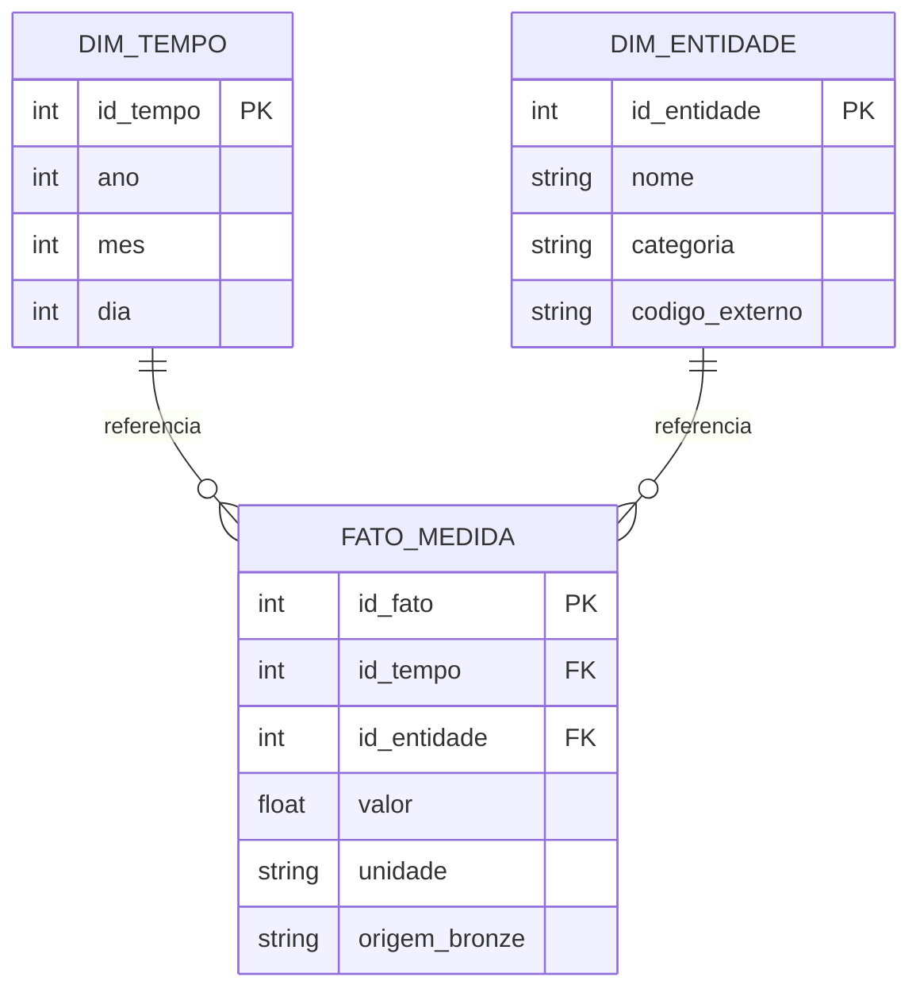

# MER — Camada Silver (Template)

```mermaid
erDiagram
    DIM_TEMPO ||--o{ FATO_MEDIDA : referencia
    DIM_ENTIDADE ||--o{ FATO_MEDIDA : referencia

    DIM_TEMPO {
      int id_tempo PK
      int ano
      int mes
      int dia
    }

    DIM_ENTIDADE {
      int id_entidade PK
      string nome
      string categoria
      string codigo_externo
    }

    FATO_MEDIDA {
      int id_fato PK
      int id_tempo FK
      int id_entidade FK
      float valor
      string unidade
      string origem_bronze
    }
```
> Edite as entidades/relacionamentos conforme seu caso.
