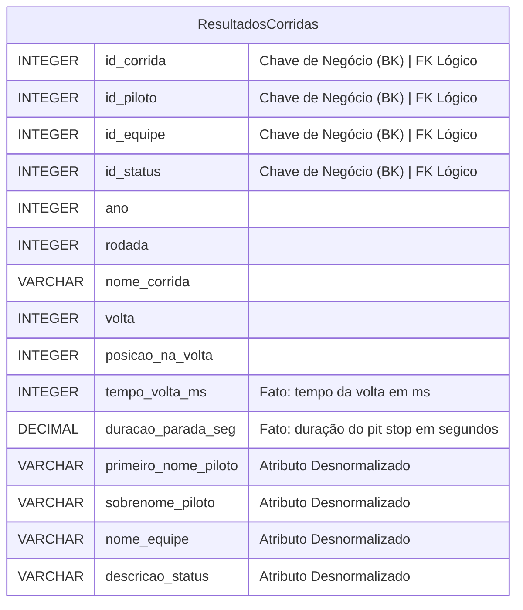

# Diagrama Entidade-Relacionamento (DER) - Camada Silver

## 1. Introdução

O DER da camada Silver evidencia que o modelo conceitual foi simplificado para uma única entidade. Não há relacionamentos, cardinalidades ou entidades auxiliares: todo o contexto necessário para análises está materializado na tabela `ResultadosCorridas`.

## 2. Estrutura do Diagrama

O diagrama reduzido apresenta somente a entidade e seus atributos principais. Optamos por manter a indicação visual em texto, já que não existem vínculos a representar.

 Tabela 1 - DER Silver

<b>Fonte: </b>Autoria de <a href="ttps://github.com/show-dawn"> Fernando Carrijo</a>. <a href="https://github.com/Julio1099"> Júlio Cesar </a>, <a href="https://github.com/kalebmacedo"> Kaleb Macedo</a> e <a href="https://github.com/bolzanMGB"> Othavio Bolzan</a>

> Nota: Todos os relacionamentos originalmente planejados na modelagem conceitual foram incorporados no processo de transformação (Bronze → Silver), e por isso não aparecem no diagrama.

## Histórico de Versão

|  **Data**  | **Versão** |            **Descrição**            |                    **Autor**                   | **Revisor** |
| :--------: | :--------: | :---------------------------------: | :--------------------------------------------: | :---------: |
| 09/10/2025 | `1.0`      | Documentação inicial do DER         | [Othavio Bolzan](https://github.com/bolzanMGB) | [Kaleb Macedo](https://github.com/kalebmacedo) |
| 09/10/2025 | `1.1`      | Criação do diagrama DER             | [Othavio Bolzan](https://github.com/bolzanMGB), [Kaleb Macedo](https://github.com/kalebmacedo) | [Júlio Cesar](https://github.com/Julio1099)  |
| 24/10/2025 | `1.2`      | Ajuste para representação de tabela única | [Kaleb Macedo](https://github.com/kalebmacedo) | [Júlio Cesar](https://github.com/Julio1099) |
| 31/10/2025 | **`1.6`** | Refatorização da documentação | [Othavio Bolzan](https://github.com/bolzanMGB) | [Kaleb Macedo](https://github.com/kalebmacedo) |