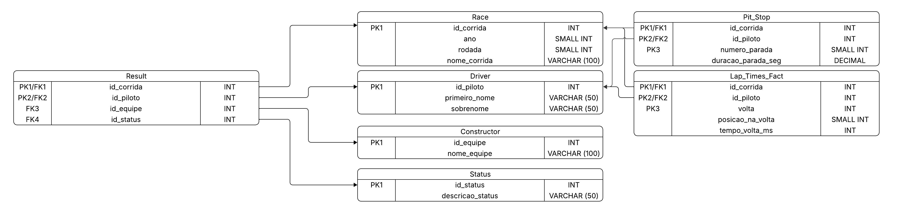

# Diagrama Lógico de Dados (DLD)

## 1. Introdução

O **Diagrama Lógico de Dados (DLD)** representa de forma estruturada a organização dos dados no sistema, descrevendo as **entidades**, seus **atributos**, e os **relacionamentos lógicos** entre elas.
Este modelo é derivado do **Modelo Entidade-Relacionamento (MER)** e serve de base para a implementação física do banco de dados (representada posteriormente no **DDL**).

No contexto deste projeto, o DLD foi elaborado para o **Data Warehouse da Fórmula 1**, permitindo armazenar e analisar informações sobre corridas, pilotos, equipes, tempos de volta, paradas e resultados.

## 2. Estrutura do Diagrama 

O diagrama a seguir representa a estrutura lógica das tabelas do banco de dados, contendo as entidades principais, seus atributos com tipos de dados, e as relações de chave primária (PK) e chave estrangeira (FK).

Cada entidade foi definida com base no modelo conceitual (MER) e detalhada com tipos de dados como INT, SMALLINT, VARCHAR, DECIMAL, entre outros, assegurando a integridade e coerência da estrutura lógica do sistema.

As conexões entre as entidades indicam as dependências referenciais (PK/FK), demonstrando a integridade relacional do banco de dados projetado.

 Figura 1 - Diagrama DLD 

  

<b>Fonte: </b>Autoria de <a href="https://github.com/bolzanMGB"> Othavio Bolzan </a>

## Histórico de Versão

|  **Data**  | **Versão** |      **Descrição**     |                   **Autor**                   |                   **Revisor**                  |
| :--------: | :--------: | :--------------------: | :-------------------------------------------: | :--------------------------------------------: |
| 09/10/2025 |    `1.0`   | Criação do DLD inicial | [Othavio Bolzan](https://github.com/bolzanMGB) | [Júlio Cesar](https://github.com/Julio1099) |

